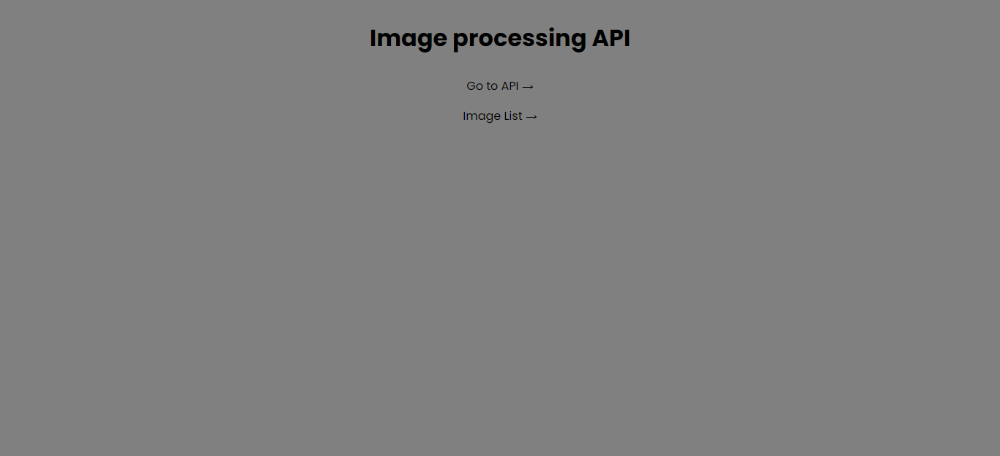
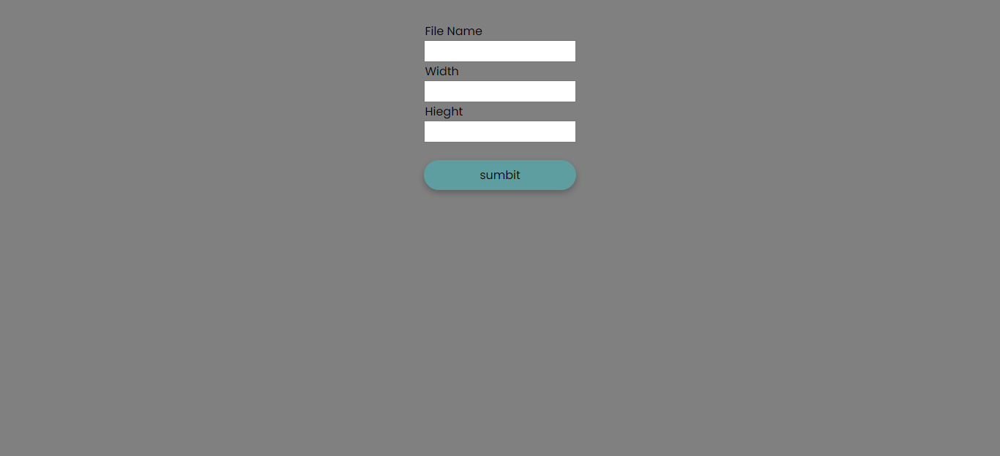
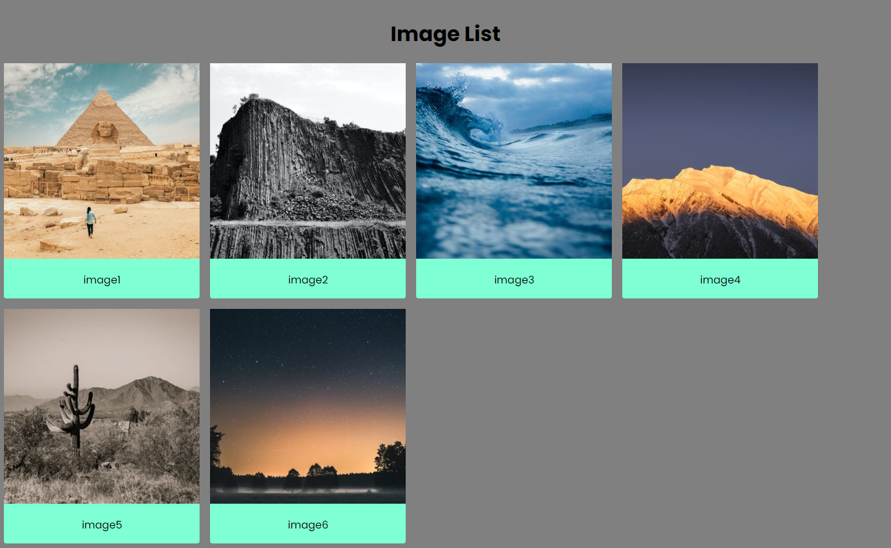

# image-processing-project-Udacity

## Table of Contents

* [overview](#overview)
* [Built with](#built-with)
* [Dependencies](#dependencies)
* [Dev-dependencies](#dev-dependencies)
* [files](#files)
* [lessons learned](#lessons-learned)
* [screen shot](#screen-shot)
* [links](#links)
* [Run](#run)
* [Author](#author)

## Overview
[(Back to top)](#table-of-contents)

An resizing API that can be used in two different ways.
- first As a simple placeholder API
- sceond as a library to serve properly scaled versions of your images to the front end to reduce page load size.


## Built with
[(Back to top)](#table-of-contents)

- Node.js
- typescript
- javascript
- HTML
- css

## Dependencies
[(Back to top)](#table-of-contents)
- [express](https://expressjs.com/)
- [sharp](https://sharp.pixelplumbing.com/)
- [morgan](https://www.npmjs.com/package/morgan)
- [apichace](https://www.npmjs.com/package/apicache)


## Dev-dependencies
[(Back to top)](#table-of-contents)
- [eslint](https://www.npmjs.com/package/eslint)
- [jasmine](https://jasmine.github.io/)
- [nodemon](https://www.npmjs.com/package/nodemon)
- [prettier](https://www.npmjs.com/package/prettier)


## files
[(Back to top)](#table-of-contents)
```
├───assests
│   ├───full
│   │       image1.jpg
│   │       image2.jpg
│   │       image3.jpg
│   │       image4.jpg
│   │       image5.jpg
│   │       image6.jpg
│   │
│   └───thumbs
│
├───build
│   │   api.js
│   │   index.js
│   │   reporter.js
│   │
│   ├───routes
│   │   │   index.js
│   │   │
│   │   ├───api
│   │   │       api.js
│   │   │
│   │   └───imageList
│   │           imageList.js
│   │           listOfImages.js
│   │
│   ├───tests
│   │   │   apiSpec.js
│   │   │   image-processingSpec.js
│   │   │   indexSpec.js
│   │   │
│   │   └───helpers
│   │           reporter.js
│   │
│   └───utilites
│       └───Image_processing
│               image-processing.js
│
├───public
│   │   api.html
│   │   imagelist.html
│   │   imagelist.js
│   │   index.html
│   │
│   └───style
│           style.css
│
├───screen-shot
│
├───spec
│   └───support
│           jasmine.json
│
└───src
    │   index.ts
    │
    ├───routes
    │   │   index.ts
    │   │
    │   ├───api
    │   │       api.ts
    │   │
    │   └───imageList
    │           imageList.ts
    │           listOfImages.ts
    │
    ├───tests
    │   │   image-processingSpec.ts
    │   │   indexSpec.ts
    │   │
    │   └───helpers
    │           reporter.ts
    │
    └───utilites
        └───Image_processing
                image-processing.ts
```

## Lessons Learned
[(Back to top)](#table-of-contents)
- building server from scratch.
- reading and writing to disk via a Node.js express server.
- working with routes.
- working with typescript.
- testing code with jasmmine
   

## screen shot
[(Back to top)](#table-of-contents)






## Links
[(Back to top)](#table-of-contents)

- Solution URL: [https://github.com/Elbassel511/image-processing-project-Udacity]


## Run

- Clone the project
- make sure node.js is installed on your pc.
- write ```npm install``` in your terminal to download modules. 
- write ```npm run start``` to run server.
- open 'localhost:3000' in your browser.
- in browser enter 'http://localhost:3000/api?filename={filename}&width={width}&height={width}' with file name, width  and height to get resized image.
- go to 'http://localhost:3000/imagelist' to see image list saved in full folder

## Author
[(Back to top)](#table-of-contents)

- Github - [@Elbassel511](https://github.com/Elbassel511)
- Linked in - [@Hamada Elbassel](https://www.linkedin.com/in/hamadaelbassel/)


